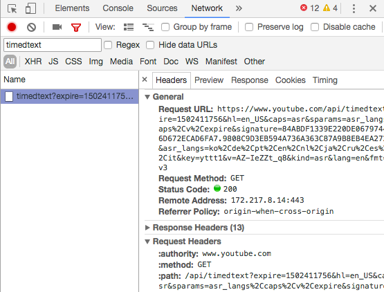

# TimedText Parser

Parse text out of YouTube's auto-generated captions. A great way of transcribing YouTube videos automatically.

*Note: this only works with some videos. Under development.*

## Getting started

First, fire up the Jupyter notebook.

Next you need to get a TimedText URL from your YouTube video. Go to the YouTube URL, open your Developer Console, go to the Network Tab, refresh the page. Then toggle on the closed captions. Wait for a bit then filter for `timedtext` in the dev tools search bar. Copy and paste the URL you see there.



## TODOs

This doesn't currently work with [this video](https://www.youtube.com/watch?v=0Ydp6bR5HXw) b/c the format is different:

```xml
<timedtext format="3">
<body>
<p t="2810" d="7450">
When you grow up you, tend to get told that the world is the way it is and your life is
</p>
<p t="10260" d="5299">
just to live your life inside the world, try not to bash into the walls too much, try to
</p>
<p t="15559" d="6351">have a nice family, have fun, save a little money.</p>
<p t="21910" d="3199">That’s a very limited life.</p>
<p t="25109" d="4711">
Life can be much broader, once you discover one simple fact, and that is that everything
</p>
<p t="29820" d="6460">
around you that you call life was made up by people that were no smarter than you.
</p>
<p t="36280" d="5110">
And you can change it, you can influence it, you can build your own things that other people
</p>
<p t="41390" d="1610">can use.</p>
<p t="43000" d="4270">
And the minute that you understand that you can poke life and actually something will,
</p>
<p t="47270" d="4241">
```
